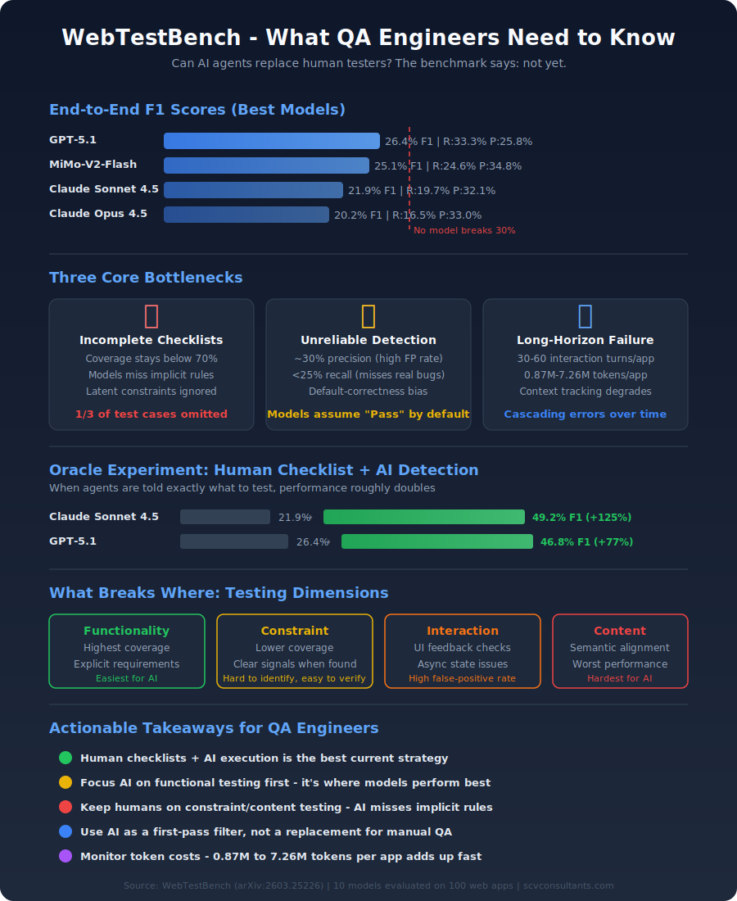
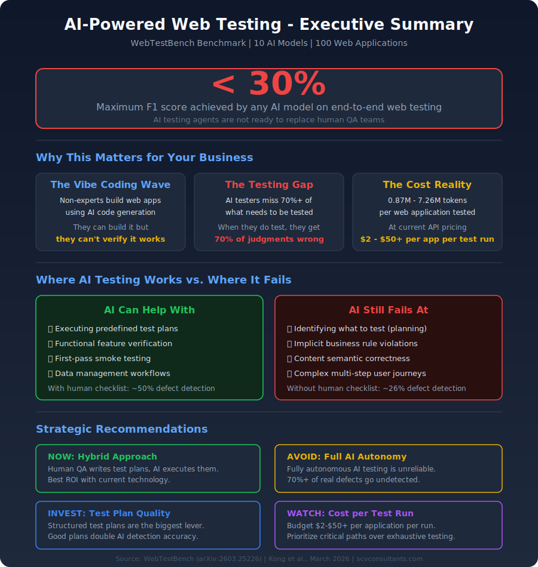

I just finished reading [WebTestBench: Evaluating Computer-Use Agents towards End-to-End Automated Web Testing](https://arxiv.org/html/2603.25226v1) by Fanheng Kong, Jingyuan Zhang, Yang Yue, Chenxi Sun, Yang Tian, Shi Feng, and colleagues (Northeastern University and Kuaishou Technology). The paper appeared on arXiv in March 2026. The [benchmark is open-source](https://github.com/friedrichor/WebTestBench).

The question it asks is simple: can AI agents that interact with web apps through screenshots and browser automation perform end-to-end testing? Not just execute predefined tests, but decide *what* to test and *whether* it works.

The answer, based on evaluating 10 models including GPT-5.1 and Claude Sonnet 4.5, is a clear **"not yet."**

## The vibe coding problem

"Vibe coding" - building web applications from natural language prompts using LLMs - is becoming mainstream. Non-expert creators can now build functional web apps without programming skills. But they also lack the expertise to verify whether those apps actually work correctly.

If the whole point of vibe coding is to remove the programming requirement, then testing itself needs to be automated end-to-end. Not just running predefined tests, but figuring out what to test in the first place.

Existing benchmarks have three gaps: they rely on human-written checklists (defeats the purpose), they assess only visual similarity or isolated interactions (not functional correctness), and they ignore latent logical constraints - business rules that are implied but never explicitly stated.

## How WebTestBench works

The benchmark synthesizes 100 web applications across seven categories (Presentation, Search, Tool, Commerce, Data Management, Workflow, User-Generated Content) using [Lovable.dev](https://lovable.dev). Human annotators build gold-standard test checklists and execute them.

Test items are organized into four quality dimensions:

- **Functionality** - do core features work?
- **Constraint** - are business rules enforced? (e.g. "same room can't be double-booked")
- **Interaction** - does the UI give correct feedback?
- **Content** - is displayed information semantically correct?

The testing task has two stages: **checklist generation** (what to test) and **defect detection** (does it pass or fail).

## The results

No model exceeds 30% F1 on end-to-end testing.

| Model | F1 | Recall | Precision | Turns/app | Tokens/app |
|-------|-----|--------|-----------|-----------|------------|
| GPT-5.1 | 26.4% | 33.3% | 25.8% | 30.3 | 0.87M |
| MiMo-V2-Flash | 25.1% | 24.6% | 34.8% | 59.8 | 7.26M |
| Claude Sonnet 4.5 | 21.9% | 19.7% | 32.1% | 37.6 | 1.90M |
| Claude Opus 4.5 | 20.2% | 16.5% | 33.0% | 42.9 | 2.60M |

Three bottlenecks drive these low scores:

**1. Incomplete checklists.** Coverage stays below 70% across all models. Even the best models omit at least one-third of test cases. The problem is worst for implicit requirements - models can extract explicit features from specs but consistently miss latent logical constraints ("the same employee cannot be assigned overlapping shifts").

**2. Unreliable detection.** Most models achieve ~30% precision (high false-positive rate - they flag working features as broken) and &lt;25% recall (most real defects go undetected). Models exhibit a "default-correctness bias" - they default to Pass when they don't observe explicit evidence of failure.

**3. Long-horizon failure.** Testing requires 30-60 interaction turns and millions of tokens per app. As interaction histories grow, models lose track of prior states and execute redundant operations. Cascading errors make long test sessions fundamentally harder than short ones.

## The oracle experiment

When agents receive the human-written gold checklist and only need to detect defects, performance roughly doubles:

- Claude Sonnet 4.5: 21.9% → **49.2% F1** (precision reaches 61.0%)
- GPT-5.1: 26.4% → **46.8% F1** (recall hits 63.4%)

This confirms that **checklist generation is the bigger bottleneck** for advanced models. When told exactly what to test, they can detect roughly half the defects. The problem is they don't know what to test in the first place.

## What breaks where

Not all testing dimensions are equally hard:

- **Functionality** achieves the highest coverage - explicit requirements are easy to extract from specs
- **Constraint** has lower coverage but higher F1 when covered - violations produce clear signals
- **Content** performs worst overall - models can't reliably judge whether displayed content semantically matches intent (e.g. "does this pet photo match the listed breed?")

## Infographic: QA Engineers

## Infographic: Management and C-Level

## What this means in practice

**For QA teams:** If your team already writes good test plans, AI agents provide more value as test executors than test planners. The hybrid approach (human checklists + AI execution) roughly doubles detection accuracy compared to fully autonomous testing.

**For engineering leaders:** The two-stage decomposition (what to test vs. how to test) is a useful framework. Teams can have humans define checklists and use agents for execution, or use agents for initial generation with human review before execution.

**For budgeting:** At 0.87M to 7.26M tokens per web application, comprehensive AI testing costs $2-$50+ per app per run. Cost-aware strategies - testing critical paths first, tiered model selection, targeted rather than exhaustive testing - are necessary for economic viability.

**For constraint/content testing:** Business logic violations and content correctness are where real bugs hide and where AI performs worst. Keep humans on these dimensions.

## Open questions

- If the best AI model achieves only 26% F1 on end-to-end web testing, what is the minimum reliability threshold at which AI testing becomes useful as a first-pass filter?
- The oracle experiment shows that telling the agent what to test roughly doubles performance. Should AI-assisted testing workflows focus on human-generated test plans with AI-powered execution?
- Constraint testing (implicit business rules like "no double bookings") is the hardest dimension. Could formal specification languages or structured requirement templates help agents identify these latent rules?

The gap between 26% F1 and production-grade testing is large. But the decomposition this paper provides - separating checklist completeness from detection accuracy - gives the field a clearer target for improvement.
