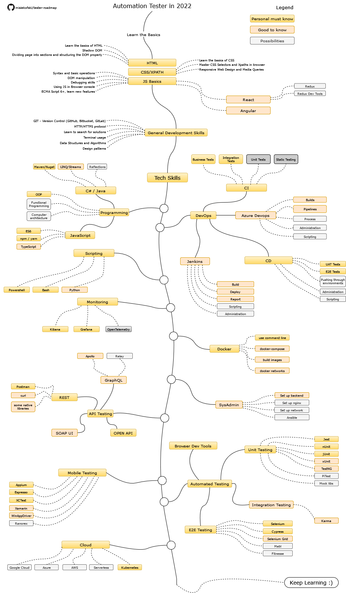

I've drawn the map (because https://roadmap.sh/qa is in upcoming status since 2020)

This is quite subjective opinion, based on my few years of experience in this area.
It's for people who HAS to automate as much as possible and does NOT cover all the knowledge and skills to be a good QA Engineer.
If you want explanation, go to the bottom of the text.

---

## Roadmap

---

## Explanation
### HTML
You have to understand how the structure of app presentation layer. Nowadays it's mostly HTML (or some kind of other Markup Languages like XML). This is a first step that will allow you to dive deeper to become QA Engineer.

### CSS/XPATH
To be able to find elements to interact with (when you automate tests) you need to understand how CSS Selectors and Xpath are working. Write good selectors, don't copy it from browser and you might get a job really fast.

### JS Basics
JavaScript is a must have. Not the level that will allow you to write your own apps, but the level that enable you to interact with DOM, write simple scripts and debug the code if needed.
JS is living language so don't forget to be up to date with newest features (at least ES6).

### General development skilss
You have to understand what GIT is, how does HTTP Protocol works and use terminal via ssh on remote machine. It's needed in your daily work.
Would be good to understand what are Desing Patterns, Data Structures and Algorithms. You don't have to remember them though.

### DevOps
Most of companies (all of the companies that you would like to work for) are not doing boring stuff manually. The automate what can be automated. So you should understand what CI/CD is, and be able to leverage that knowledge (use it, create pipelines, understand what went wrong, check the logs).

### Programming skills
One way or the other you will have to learn at least one of the languages for test automation. I suggest either JS or Java/C# (pick one). 

### Scripting
How do we automate boring stuff? Either powershell (in Windows world), Bash (in Linux world) or Python (both worlds). You don't want to press 10 buttons after git push to be able to test app on UAT environment.

### Monitoring
Something went wrong with an app? Find the logs (preferably on the backend side). Don't post bug report with "something is wrong" title. It also would be good for you to know how to visualize data (heatmaps, histograms and charts).

### Docker
You have to understand containers. It's not that hard. It's just a virtual machine that is not a virtual machine. And it won't take long until you get it.

### API Testing
Its faster, more reliable and gives often better business value for business case coverage. You should combine this with UI testing.

### Automated Testing
I've picked both Selenium and Cypress (altough Playwright is trying to catch up with those two). But before you do that, try to understand and write some Unit Tests. Reading them will help you not to duplicate the things that already covered by developers.
Oh, and DevTools in browser are your friend. It's really possible to automate a lot in plain browser with a bit of JavaScript.

### Cloud
Nowadays we use Kubernetes for most of the things. It would be good to understand how to spin up local cluster and run application.
And interaction with cloud (either Azure or AWS or GC) will be one of your daily tasks.